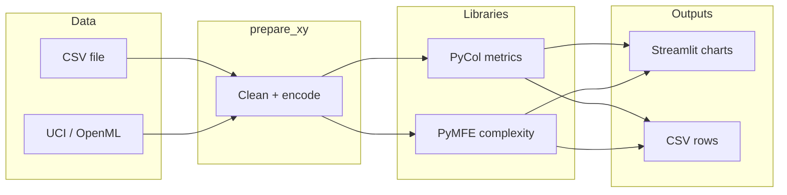

# Dataset Complexity

A modern toolkit to measure **how hard a classification dataset is** for machine learning, using **[PyCol](https://pypi.org/project/pycol-complexity/)** and **[PyMFE](https://pypi.org/project/pymfe/)** complexity meta-features.

Use it three ways:

| Mode | Best for |
|------|----------|
| **Streamlit app** | Interactive exploration, plots, metric reference |
| **CLI** (`parallel_complexity_cli.py` **v1.7.0**) | One dataset, servers, automation |
| **Batch shell** (`run_batch_parallel.sh`) | Many UCI/OpenML/CSV datasets into one CSV |

**Maintainer:** Aghil Hooshmand — Research Fellow, FORGE · BDS, University of Limerick · `aghil.hooshmand@ul.ie`

---

## Table of contents

1. [Quick start](#quick-start)
2. [What this project adds](#what-this-project-adds)
3. [PyCol challenges and how we address them](#pycol-challenges-and-how-we-address-them)
4. [Streamlit app](#streamlit-app)
5. [CLI reference](#cli-reference)
6. [Batch script](#batch-script)
7. [PyCol metrics and presets](#pycol-metrics-and-presets)
8. [PyMFE metrics](#pymfe-metrics)
9. [Preprocessing and missing values](#preprocessing-and-missing-values)
10. [Validate HEOM (optional)](#validate-heom-optional)
11. [Output CSV columns](#output-csv-columns)
12. [Project layout](#project-layout)
13. [Troubleshooting](#troubleshooting)
14. [References](#references)

---

## Quick start

**Requirements:** Python **3.10+** (tested on 3.13), `pip`, ~2 GB disk for a venv.

```bash
cd /path/to/DataComplexity
python3 -m venv .venv
source .venv/bin/activate          # Windows: .venv\Scripts\activate
pip install --upgrade pip
pip install -r requirements.txt
```

**Interactive UI:**

```bash
streamlit run app.py
```

**One dataset (CLI):**

```bash
python parallel_complexity_cli.py --version
python parallel_complexity_cli.py \
  --source uci --ref 186 --label-column target \
  --library pycol --metrics cheap \
  --pycol-distance-matrix build --pycol-parallel-heom \
  --missing-values impute_median \
  --output-csv results/wine.csv
```

**Many datasets (batch):**

```bash
chmod +x run_batch_parallel.sh
./run_batch_parallel.sh
```

Results: `results/batch_parallel_complexity.csv` (one row per dataset, upserted by `dataset_name`).

---

## What this project adds

PyCol and PyMFE are powerful but awkward for **repeated benchmarking** on messy tabular data. This repo provides:

- **Unified loading** — CSV, UCI (`ucimlrepo`), OpenML (`openml`)
- **Consistent preprocessing** — missing tokens, one-hot categoricals, imputation strategies
- **Preset metric groups** — `cheap_minimal`, `cheap`, `expensive_core`, …
- **Faster HEOM distance matrices** — [`pycol_heom.py`](pycol_heom.py) (same PyCol definition, vectorized build)
- **RAM-aware modes** — skip vs build distance matrix; subsampling; batch per-dataset row caps
- **Streamlit workspace** — calculator, multi-dataset comparison, metric reference with PyCol illustrations



---

## PyCol challenges and how we address them

### Challenge 1 — The distance matrix is slow

Many PyCol measures (N2, N3, N1, kDN, …) need an **n×n pairwise distance table** (HEOM). Stock PyCol builds it with **nested Python loops** — fine for small data, impractical for tens of thousands of rows.

**What we did:** [`pycol_heom.py`](pycol_heom.py) computes the **same HEOM matrices** with vectorized NumPy (optional multi-core row workers). PyCol metric code then reads `dist_matrix` unchanged.

**Proof:** [`validate_pycol_heom.py`](validate_pycol_heom.py) compares native PyCol vs our build (e.g. wine UCI 186).

```bash
python validate_pycol_heom.py --uci-id 186 --n-rows 500
```

### Challenge 2 — The distance matrix uses a lot of RAM

Two float64 matrices are stored: `dist_matrix` and `unnorm_dist_matrix`.

```text
Approximate RAM ≈ 16 × n² bytes
  n =  5,000  →  ~0.4 GB
  n = 10,000  →  ~1.6 GB
  n = 48,000  →  ~37 GB   (e.g. Adult — feasible on a 125 GB server)
  n =253,000  →  ~1 TB    (CDC full sample — not feasible without subsampling)
```

**What we did:**

| Strategy | Where |
|----------|--------|
| **Skip** matrix | `--pycol-distance-matrix skip` / Streamlit “Skip” |
| **Subsample** | `--complexity-max-rows N` / `COMPLEXITY_MAX_ROWS` |
| **Per-dataset cap** | 4th field in `DATASETS` (batch) — CDC defaults to `75000` on large-RAM profiles |
| **One matrix, sequential metrics** | Default for n ≥ 5,000 (avoids duplicating matrices per worker) |

### Challenge 3 — Categorical features

PyCol HEOM supports a **categorical mismatch** rule (`meta[k]=1`). In **this project’s pipeline**, string categories are **one-hot encoded** first (`prepare_xy`), then treated as **numeric HEOM** on 0/1 columns — the usual path for UCI CSVs loaded through the app/CLI.

### Challenge 4 — Large jobs look “single-core”

Even on an 82-core server you may see **one busy CPU** for long stretches:

- **Batch** runs datasets **one after another**
- For **n ≥ 5,000**, metrics run **sequentially** in one process (lower RAM)
- **Multi-core bursts** happen mainly during **parallel HEOM build** (`--pycol-parallel-heom`)

Use `--pycol-parallel-metrics` only on **small n**; on large n each worker may rebuild the full matrix and exhaust RAM.

---

## Streamlit app

```bash
streamlit run app.py
```

| Page | Purpose |
|------|---------|
| **Complexity Calculator** | One dataset (upload / UCI / OpenML), metrics, t-SNE, CSV download |
| **Dataset Comparison** | Several datasets, comparison table and per-metric bar charts |
| **Compare Uploaded Results** | Merge external CSVs for benchmarking |
| **Metric Reference** | Plain-language metric notes and PyCol documentation figures |

### Recommended first run

1. Load a dataset (e.g. UCI Wine `186`).
2. Label column: `target` (UCI/OpenML default).
3. Missing values: **`impute_median`**.
4. Library: **PyCol**, preset **`cheap_minimal`**.
5. Distance matrix: **Skip** (fast).
6. **Compute complexity**.

When you need **N2, N3, C1, C2**, switch preset to **`cheap`** and distance matrix to **Build** (optionally enable **Parallel HEOM**). The UI shows RAM estimates.

---

## CLI reference

**Entry point:** `parallel_complexity_cli.py` · **version 1.7.0**

```bash
python parallel_complexity_cli.py --version
python parallel_complexity_cli.py --help
```

### CLI arguments

| Argument | Default | Meaning |
|----------|---------|---------|
| `--source` | *(required)* | `csv`, `uci`, or `openml` |
| `--ref` | *(required)* | CSV path, dataset id, or full archive URL (id parsed from string) |
| `--label-column` | `target` | Class label column name |
| `--library` | `both` | `pycol`, `pymfe`, or `both` |
| `--metrics` | `all` | When `--library pycol` or `pymfe`: preset, `all`, `custom`, or comma list |
| `--pycol-metrics` | `all` | When `--library both`: PyCol side (same options as `--metrics`) |
| `--pycol-custom-metrics` | — | Required with `custom`, e.g. `F1,N3,N2` |
| `--pymfe-metrics` | `all` | When `--library both`: PyMFE side |
| `--missing-values` | `impute_median` | `impute_median`, `impute_mean`, `fill_zero`, `drop_rows` |
| `--output-csv` | `parallel_dataset_complexity.csv` | Output path; upserts by `dataset_name` |
| `--complexity-max-rows` | `0` | If `N > 0`, random subsample to N rows (fixed seed) for metrics |
| `--n-jobs` | half of CPUs | Cap for parallel HEOM rows and/or metric pool |
| `--pycol-distance-matrix` | `skip` | `skip` = no n×n table; `build` = HEOM + distance-based metrics |
| `--pycol-parallel-heom` | off | Multi-process row build via `pycol_heom.py` (requires `build`) |
| `--pycol-parallel-metrics` | off | One process per metric; **high RAM** on large n |
| `--no-progress` | off | Quiet mode for logs and batch |
| `--version` | — | Print CLI version |

### Example commands

**Fast screening (no distance matrix):**

```bash
python parallel_complexity_cli.py \
  --source uci --ref 186 --label-column target \
  --library pycol --metrics cheap_minimal \
  --pycol-distance-matrix skip \
  --output-csv results/wine_fast.csv
```

**Structure metrics with fast HEOM (server-friendly):**

```bash
python parallel_complexity_cli.py \
  --source uci --ref 2 --label-column target \
  --library pycol --metrics cheap \
  --pycol-distance-matrix build --pycol-parallel-heom \
  --n-jobs 24 --missing-values impute_median \
  --output-csv results/adult_cheap.csv
```

**Large dataset — subsampled approximate run:**

```bash
python parallel_complexity_cli.py \
  --source uci --ref 891 --label-column target \
  --library pycol --metrics cheap \
  --pycol-distance-matrix build --pycol-parallel-heom \
  --complexity-max-rows 75000 --n-jobs 24 \
  --output-csv results/cdc_cheap.csv
```

**PyMFE only:**

```bash
python parallel_complexity_cli.py \
  --source csv --ref /data/myset.csv --label-column class \
  --library pymfe --metrics all \
  --output-csv results/myset_pymfe.csv
```

**Both libraries:**

```bash
python parallel_complexity_cli.py \
  --source uci --ref 17 --label-column target \
  --library both \
  --pycol-metrics cheap --pymfe-metrics c1,c2,t2,t3 \
  --pycol-distance-matrix build \
  --output-csv results/breast_both.csv
```

---

## Batch script

Edit variables at the top of [`run_batch_parallel.sh`](run_batch_parallel.sh), then:

```bash
./run_batch_parallel.sh
```

**Dry-run** (print commands only):

```bash
DRY_RUN=1 ./run_batch_parallel.sh
```

### Batch variables

| Variable | Typical value | Meaning |
|----------|---------------|---------|
| `LIBRARY` | `pycol` | `pycol`, `pymfe`, or `both` |
| `N_JOBS` | `24` | Worker cap (HEOM + optional metric pool) |
| `MISSING_VALUES` | `impute_median` | Same as CLI |
| `OUTPUT_CSV` | `results/batch_parallel_complexity.csv` | Combined results |
| `COMPLEXITY_MAX_ROWS` | `0` | Global subsample cap (`0` = all rows) |
| `PYCOL_METRICS_ARG` | `cheap` | PyCol preset or comma list |
| `PYCOL_DISTANCE_MATRIX` | `build` | `skip` or `build` |
| `PYCOL_PARALLEL_HEOM` | `1` | Adds `--pycol-parallel-heom` when `build` |
| `PYCOL_PARALLEL_METRICS` | `0` | Keep `0` for full-sample + build on large sets |
| `DATASETS` | see script | `source\|ref\|label\|[max_rows]` per line |
| `DRY_RUN` | `0` | `1` = print only |
| `CONTINUE_ON_ERROR` | `1` | Continue after a failed dataset |

**Dataset line format:**

```text
uci|https://archive.ics.uci.edu/dataset/186/wine+quality|target
uci|https://archive.ics.uci.edu/dataset/891/cdc+diabetes+health+indicators|target|75000
csv|/absolute/path/to/data.csv|class
```

Optional **4th field** `max_rows` overrides `COMPLEXITY_MAX_ROWS` for that line only (used for CDC on ~125 GB RAM).

The script uses `.venv/bin/python` automatically when present.

---

## PyCol metrics and presets

PyCol implements meta-features from the **classification complexity** literature (feature overlap **F**, neighborhood **N**, topology **T**, class imbalance **C**, etc.).

**Primary reference:** Lorena, João, et al. *How Complex Is Your Classification Problem?* IEEE TEVC, 2019.  
**Package:** [pycol-complexity on PyPI](https://pypi.org/project/pycol-complexity/)

### Presets (Streamlit, CLI, batch)

| Preset | Metrics | Distance matrix |
|--------|---------|-----------------|
| **`cheap_minimal`** | F1, F2, F3, F4, F1v, input_noise, purity | **Not required** |
| **`cheap`** | F1, F2, F3, N2, N3, C1, C2 | **Required** |
| **`expensive_core`** | N1, N4, T1, LSC, kDN, borderline | **Required** |
| **`expensive`** | All PyCol metrics **not** in `cheap` | Mixed |
| **`all`** | Full catalog below | Most need matrix |
| **`custom`** | Your comma-separated list | Depends on metrics |

### Metrics that do **not** need the distance matrix

`F1`, `F2`, `F3`, `F4`, `F1v`, `input_noise`, `purity`

### Full PyCol catalog (this repo)

`F1`, `F1v`, `F2`, `F3`, `F4`, `input_noise`, `R_value`, `deg_overlap`, `N3`, `SI`, `N4`, `kDN`, `D3_value`, `CM`, `N1`, `T1`, `Clust`, `ONB`, `LSC`, `DBC`, `N2`, `NSG`, `ICSV`, `MRCA`, `C1`, `C2`, `purity`, `neighbourhood_separability`, `borderline`

### Short guide by family

| Family | Examples | Idea |
|--------|----------|------|
| **F** | F1, F2, F3, F4 | Feature overlap / separability along axes |
| **N** | N1, N2, N3, N4 | Neighborhood / boundary difficulty |
| **T** | T1, Clust, ONB | Topology / coverage |
| **C** | C1, C2 | Class imbalance and entropy |
| **Other** | kDN, LSC, purity, borderline | Specialized structure measures |

In-app descriptions and figures: **Metric Reference** page (also grounded in [`metric_catalog.py`](metric_catalog.py)).

---

## PyMFE metrics

PyMFE exposes a **complexity** group of meta-features (lowercase names in CSV: `pymfe_c1`, …).

**Primary reference:** Rivolli, André Luiz, et al. *Pymfe: toward a unified framework for meta-feature extraction.* JMLR 2023.  
**Docs:** [PyMFE complexity group](https://pymfe.readthedocs.io/en/latest/generated/pymfe.complexity.MFEComplexity.html)

### Often used (catalog in repo)

| ID | Summary |
|----|---------|
| **f1–f4** | Fisher / overlap / efficiency (analogous families to PyCol F*) |
| **l1–l3** | Linear separability complexity |
| **n1–n4** | Neighborhood and boundary complexity |
| **t1–t4** | Topology and dimensionality (e.g. PCA ratio) |
| **c1, c2** | Entropy and imbalance |
| **lsc, hubs, density, cls_coef** | Graph / neighborhood structure |

Run **`--metrics all`** (or `PYMFE_METRICS="all"` in batch) to extract every complexity feature PyMFE exposes at runtime. The Streamlit **Metric Reference** page lists curated descriptions.

**Note:** PyCol and PyMFE names look similar (`n3` vs `N3`) but are **different implementations** — compare trends, not exact numeric equality.

---

## Preprocessing and missing values

Pipeline in [`complexity_core.py`](complexity_core.py) (`prepare_xy`):

1. Strip label column; normalize missing tokens (`?`, blanks, …) → NaN  
2. **One-hot encode** object/category columns (`pd.get_dummies`)  
3. Coerce features to numeric  
4. Apply missing-value strategy on **features** (rows with missing labels are dropped)  

| Strategy | CLI / batch | Effect |
|----------|-------------|--------|
| **`impute_median`** | default | Column medians; remaining gaps → 0 |
| **`impute_mean`** | | Column means |
| **`fill_zero`** | | NaN → 0 |
| **`drop_rows`** | | Drop rows with any feature NaN — strict; **Adult** often loses most rows |

---

## Validate HEOM (optional)

Confirm project **Build** matrices match native PyCol:

```bash
python validate_pycol_heom.py --uci-id 186 --n-rows 500
python validate_pycol_heom.py --synthetic --synthetic-rows 200
```

Exit code **0** = PASS. See also [`docs/pycol_heom_build_slides.md`](docs/pycol_heom_build_slides.md) for a non-technical team summary.

---

## Output CSV columns

| Column pattern | Description |
|----------------|-------------|
| `dataset_name`, `source`, `label_column` | Run identity |
| `n_rows_original`, `n_rows_used`, `n_features_after_encoding`, `n_classes` | Shape / sampling |
| `pycol_*` | PyCol metric values |
| `pymfe_*` | PyMFE metric values |
| `pycol_metrics_preset`, `pycol_skip_distance_matrix` | PyCol run settings |
| `pycol_distance_matrix_skipped` | True when matrix was skipped |
| `pycol_metrics_omitted_need_distance` | Metrics skipped because of `skip` |
| `pycol_sequential_large_n` | True when n ≥ 5000 sequential path was used |
| `pycol_heom_parallel` | True when parallel HEOM was used |
| `complexity_subsampled`, `complexity_max_rows` | Subsample metadata |
| `parallel_cli_version` | CLI version string (**1.7.0**) |

---

## Project layout

```text
app.py                          # Streamlit home
pages/                          # Calculator, Comparison, Metric Reference, …
complexity_core.py              # prepare_xy, presets, compute_pycol_metrics
pycol_heom.py                   # Fast HEOM matrix build
parallel_complexity_cli.py      # CLI v1.7.0
run_batch_parallel.sh           # Multi-dataset batch
validate_pycol_heom.py          # Native vs build matrix check
metric_catalog.py               # Metric titles and references
metric_ui.py                    # Streamlit metric controls
results/                        # Default CSV outputs
docs/pycol_heom_build_slides.md # Team slides (non-technical)
requirements.txt
```

---

## Troubleshooting

| Symptom | What to try |
|---------|-------------|
| `ModuleNotFoundError` | `source .venv/bin/activate` and `pip install -r requirements.txt` |
| UCI / OpenML load fails | Check id/URL, network, `ucimlrepo` / `openml` install |
| Process killed / OOM | `cheap_minimal` + `skip`, or lower `--complexity-max-rows`, or per-dataset `max_rows` in batch |
| Very slow, one CPU | Expected for large n during N3; enable `--pycol-parallel-heom`; avoid `--pycol-parallel-metrics` on large n |
| Metrics missing in CSV | They need `build` — check `pycol_metrics_omitted_need_distance` |
| Adult + `drop_rows` empty | Use `impute_median` |
| Streamlit UI stale | Hard-refresh browser tab |
| Clickstream UCI 553 fails | Known `ucimlrepo` issue — batch continues if `CONTINUE_ON_ERROR=1` |

**Monitor server resources:**

```bash
nproc && free -h    # cores and RAM
htop                # live CPU/RAM while a job runs
```

---

## References

| Resource | Link / citation |
|----------|-----------------|
| PyCol complexity paper | Lorena, J., et al. (2019). *How Complex Is Your Classification Problem?* [IEEE TEVC](https://doi.org/10.1109/TEVC.2018.2869000) |
| PyCol package | https://pypi.org/project/pycol-complexity/ |
| PyMFE paper | Rivolli, A. L., et al. (2023). *Pymfe: toward a unified framework for meta-feature extraction.* [JMLR](https://jmlr.org/papers/v24/22-0433.html) |
| PyMFE complexity API | https://pymfe.readthedocs.io/en/latest/generated/pymfe.complexity.MFEComplexity.html |
| UCI ML Repository | https://archive.ics.uci.edu/ |

---

## License and contributing

Use and adapt within your research workflows. For feature requests or benchmark presets, contact the maintainer above.
