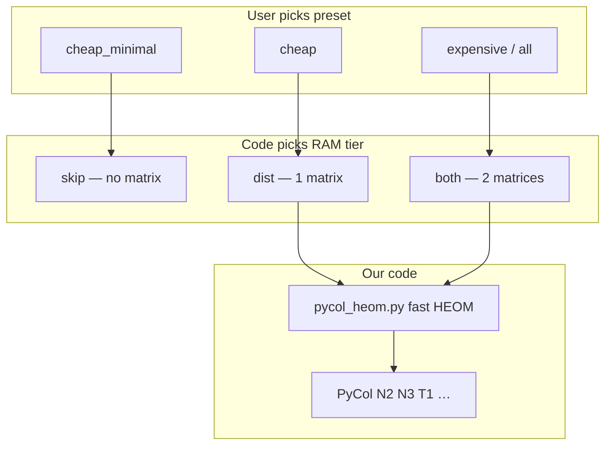

# PyCol complexity tool — team slides

**Audience:** non-technical team · **Also see:** [README.md](../README.md) for full CLI/batch reference.

Copy each **Slide** into PowerPoint / Google Slides (~2 min per slide).

---

## Slide 1 — Why this project exists

### Title
**Dataset complexity with PyCol — what we measure and what hurt**

### What we measure
- **PyCol** scores how **hard** a classification dataset is (class overlap, local neighbourhoods, imbalance, …).
- Some scores only need the **table of features + labels**.
- Others need a **pairwise distance table**: for every pair of rows, “how far apart?” (HEOM metric).

### Challenges we found

| # | Challenge | Impact |
|---|-----------|--------|
| **1** | **Too slow** | Stock PyCol builds the distance table with **nested Python loops** → unusable on 5k–50k rows. |
| **2** | **Too much RAM** | PyCol stores **two** full n×n tables (`dist` + `unnorm`). RAM ≈ **16×n² bytes** for both. |
| **3** | **Not all metrics need both tables** | e.g. **cheap** preset (N2, N3, C1, C2) only needs the **normalized** table — second table was wasted RAM. |
| **4** | **Messy real data** | Missing values, categories → we clean and one-hot encode before HEOM. |
| **5** | **Servers look “one CPU”** | Batch runs one dataset at a time; metric step is often sequential on large n (by design, to save RAM). |

### One sentence
> *PyCol was correct but too slow and too heavy in memory; we kept the same maths and made the pipeline practical.*

---

## Slide 2 — How we improved the PyCol path (code)

### Title
**Faster HEOM + smarter memory — same PyCol scores**

### Improvement 1 — Faster distance build (`pycol_heom.py`)

| Before (stock PyCol) | After (our build) |
|----------------------|-------------------|
| Triple **Python** loops over rows × rows × features | **Vectorized NumPy** (+ optional parallel rows) |
| Same HEOM rules (range-normalized numeric features) | **Validated** vs native PyCol on wine |
| One slow step before N2, N3, … | Same formulas; much less wall-clock on matrix build |

**We did not rewrite** N3, N2, etc. — PyCol still computes those from the table we fill.

### Improvement 2 — Three RAM levels (automatic from preset)

User picks **one preset**; the app/CLI/batch picks storage:

| Level | Name | What is stored | Typical preset |
|-------|------|----------------|----------------|
| **A** | `skip` | No distance table | `cheap_minimal` |
| **B** | `dist` | One table (normalized HEOM) | `cheap` |
| **C** | `both` | Two tables (normalized + unnormalized) | `expensive`, `expensive_core`, `all` |

**RAM example (n = 48,000, Adult):**
- Both tables ≈ **37 GB**
- One table (`cheap`) ≈ **18 GB** (~half)

### Improvement 3 — Custom metrics

If the user picks **custom** metrics, the code **infers** the level:
- Only F1, F2, … → **skip**
- N2, N3, … → **dist**
- **T1**, **NSG**, **ICSV** (unnormalized geometry) → **both**

### Proof
```bash
python validate_pycol_heom.py --uci-id 186 --n-rows 500
```

---

## Slide 3 — What users choose (presets only)

### Title
**Three presets = three RAM levels — no manual matrix tuning**

### PyCol presets (pick one)

| Preset | What you get | Memory level |
|--------|----------------|--------------|
| **`cheap_minimal`** | Fast overlap / purity style metrics (F1–F4, F1v, …) | **A — skip** |
| **`cheap`** | Above + structure metrics **N2, N3, C1, C2** | **B — one matrix** |
| **`expensive` / `expensive_core` / `all`** | Neighbourhood / topology set (includes **T1**) | **C — two matrices** |
| **`custom`** | You select metric names | **Auto** from selection |

### Streamlit
1. Load data → `impute_median` → choose **PyCol preset**.
2. UI shows **HEOM tier** automatically (no skip/build confusion).
3. Optional: **Parallel HEOM build** when tier is B or C.

### Batch (`run_batch_parallel.sh`)
- Set `PYCOL_METRICS_ARG="cheap"` (or minimal / expensive).
- Set `PYCOL_DISTANCE_MATRIX="auto"` (recommended).
- CDC line uses `|75000` row cap — full 253k rows needs ~1 TB for two matrices.

### One sentence
> *Pick cheap_minimal, cheap, or expensive — the system decides skip, one matrix, or two matrices.*

---

## Slide 4 — Arguments & config (technical handout)

### Title
**CLI / batch arguments after the 2025 HEOM update**

### CLI (`parallel_complexity_cli.py` v1.7.0)

| Argument | Values | Meaning |
|----------|--------|---------|
| `--metrics` | `cheap_minimal`, `cheap`, `expensive_core`, `expensive`, `all`, `custom`, or `F1,N3,…` | Metric preset or list |
| `--pycol-distance-matrix` | **`auto`** (default), `skip`, `dist`, `both` | HEOM RAM tier; `auto` follows preset / custom inference |
| `--pycol-parallel-heom` | flag | Multi-core row build (tier B or C only) |
| `--pycol-parallel-metrics` | flag | One process per metric — **avoid on large n** (RAM) |
| `--complexity-max-rows` | `0` or N | Subsample rows for speed/RAM |
| `--n-jobs` | e.g. `24` | Cap for HEOM workers |

**Examples:**
```bash
# Level A
--metrics cheap_minimal --pycol-distance-matrix auto

# Level B (Adult on 125 GB server)
--metrics cheap --pycol-distance-matrix auto --pycol-parallel-heom --n-jobs 24

# Level C
--metrics expensive_core --pycol-distance-matrix auto
```

### Batch shell variables

| Variable | Example | Notes |
|----------|---------|--------|
| `PYCOL_METRICS_ARG` | `cheap` | Drives preset → matrix tier when `auto` |
| `PYCOL_DISTANCE_MATRIX` | `auto` | `skip` / `dist` / `both` to force |
| `PYCOL_PARALLEL_HEOM` | `1` | Parallel matrix build |
| `PYCOL_PARALLEL_METRICS` | `0` | Keep off for full-sample batches |
| `COMPLEXITY_MAX_ROWS` | `0` | Global subsample; CDC uses `|75000` per line |

### New CSV columns
- `pycol_matrix_mode` — `skip`, `dist`, or `both`
- `pycol_heom_unnorm_skipped` — true when only one matrix was stored

### Legacy note
- Old flag **`build`** → now means **`auto`** (infer tier), not “always two matrices”.
- Streamlit no longer asks skip vs build manually for presets.

---

## Cheat sheet — Q&A

| Question | Short answer |
|----------|----------------|
| What were the challenges? | Slow HEOM loops; huge RAM (two matrices); not all metrics need both tables. |
| How did we improve PyCol code? | `pycol_heom.py`: vectorized HEOM + optional skip of 2nd matrix. |
| Is it still PyCol? | **Yes** for metric values; **our** code only builds the table faster/cheaper. |
| cheap vs cheap_minimal? | minimal = no table; cheap = **one** table for N2,N3,C1,C2. |
| Why two matrices in PyCol? | Normalized distances for most metrics; **unnormalized** for T1-style hypersphere logic. |
| Why only one matrix for cheap? | N2,N3,C1,C2 use **dist_matrix** only — saves ~50% RAM. |
| What is HEOM vs Euclidean? | HEOM scales each feature by column range; handles mixed data better than raw Euclidean. |
| Why one CPU on server? | Datasets run in series; large n uses one process for metrics; HEOM build can use many cores briefly. |
| How prove correctness? | `validate_pycol_heom.py` on wine (matrices + N3). |
| CDC full sample? | Needs ~1 TB for two matrices — use row cap or `cheap` (one matrix). |

---

## Diagram (optional slide)


