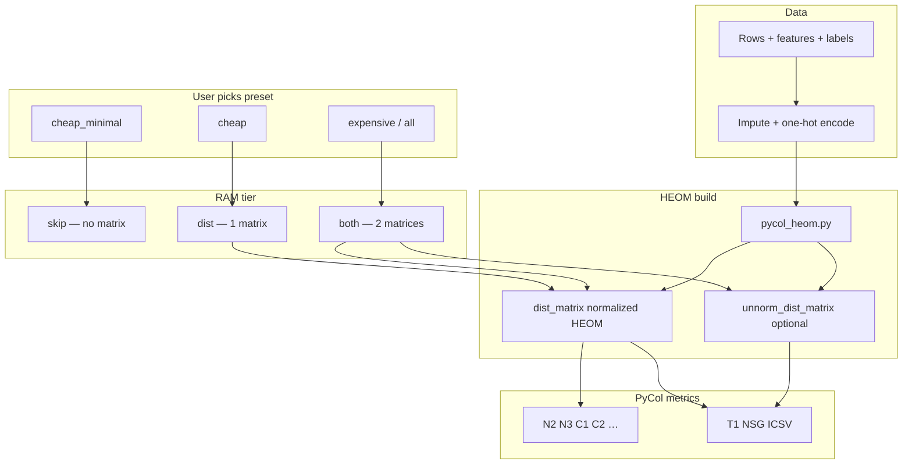

# PyCol complexity tool — team slides

**Audience:** non-technical team · **Also see:** [README.md](../README.md) for full CLI/batch reference.

Copy each **Slide** into PowerPoint / Google Slides (~2 min per slide). **5 slides** + optional diagram.

---

## Slide 1 — Why this project exists

### Title
**Dataset complexity with PyCol — what we measure and what hurt**

### What we measure
- **PyCol** scores how **hard** a classification dataset is (class overlap, local neighbourhoods, imbalance, …).
- Some scores only need the **table of features + labels**.
- Others need a **pairwise distance table**: for every pair of rows, “how far apart?” — built with **HEOM** (see Slide 2).

### Challenges we found

| # | Challenge | Impact |
|---|-----------|--------|
| **1** | **Too slow** | Stock PyCol builds the distance table with **nested Python loops** → unusable on 5k–50k rows. |
| **2** | **Too much RAM** | PyCol stores **two** full n×n tables (`dist` + `unnorm`). RAM ≈ **16×n² bytes** for both. |
| **3** | **Not all metrics need both tables** | e.g. **cheap** preset (N2, N3, C1, C2) only needs the **normalized** table — second table was wasted RAM. |
| **4** | **Messy real data** | Missing values, categories → we clean and one-hot encode before HEOM. |
| **5** | **Servers look “one CPU”** | Batch runs one dataset at a time; metric step is often sequential on large n (by design, to save RAM). |

### One sentence
> *PyCol was correct but too slow and too heavy in memory; we kept the same maths and made the pipeline practical.*

---

## Slide 2 — What is HEOM? (and how we use it here)

### Title
**HEOM — the distance PyCol uses between every pair of rows**

### Name
**HEOM** = **H**eterogeneous **E**uclidean-**O**verlap **M**etric (PyCol’s default; only distance implemented in stock PyCol).

### What it answers
For **n** rows and **p** features, PyCol needs **n × n** distance matrices.  
Entry \((i,j)\) = HEOM distance between row \(i\) and row \(j\).  
Those tables feed **N2, N3, C1, C2, kDN, …** (normalized) and **T1, NSG, ICSV** (also unnormalized).

---

### Notation (for the formulas)

| Symbol | Meaning |
|--------|---------|
| \(x_{ik}\) | Value of feature \(k\) on row \(i\) |
| \(M\) | Number of features (\(k = 1,\ldots,M\)) |
| \(\mathrm{meta}_k\) | `0` = numeric, `1` = categorical (PyCol) |
| \(R_k\) | Column range: \(R_k = \max_i x_{ik} - \min_i x_{ik}\) |
| \(\mathrm{miss}(i,k)\) | True if \(x_{ik}\) is missing / `NaN` |

---

### Formulas — per-feature penalty \(p_k(i,j)\)

Add one penalty per feature, then take a **square root** at the end (Euclidean-style aggregation).

#### 1) Numeric feature (\(\mathrm{meta}_k = 0\))

Let \(\Delta_{ikj} = \lvert x_{ik} - x_{jk}\rvert\).

**If either value is missing** (\(\mathrm{miss}(i,k)\) or \(\mathrm{miss}(j,k)\)):

\[
p_k^{\mathrm{norm}}(i,j) = p_k^{\mathrm{unnorm}}(i,j) = 1
\]

**Else if \(R_k = 0\)** (constant column):

\[
p_k^{\mathrm{norm}}(i,j) = p_k^{\mathrm{unnorm}}(i,j) = \Delta_{ikj}^{\,2}
\]

**Else (\(R_k > 0\))** — normalized uses range; unnormalized uses raw gap squared:

\[
p_k^{\mathrm{norm}}(i,j) = \left(\frac{\Delta_{ikj}}{R_k}\right)^{2},
\qquad
p_k^{\mathrm{unnorm}}(i,j) = \Delta_{ikj}^{\,2}
\]

#### 2) Categorical feature (\(\mathrm{meta}_k = 1\)) — stock PyCol

**If missing, or \(x_{ik} \neq x_{jk}\):**

\[
p_k^{\mathrm{norm}}(i,j) = p_k^{\mathrm{unnorm}}(i,j) = 1
\]

**Else** (same category):

\[
p_k^{\mathrm{norm}}(i,j) = p_k^{\mathrm{unnorm}}(i,j) = 0
\]

#### 3) Final HEOM distances (what goes in the matrices)

\[
d^{\mathrm{norm}}(i,j) = \sqrt{\sum_{k=1}^{M} p_k^{\mathrm{norm}}(i,j)},
\qquad
d^{\mathrm{unnorm}}(i,j) = \sqrt{\sum_{k=1}^{M} p_k^{\mathrm{unnorm}}(i,j)}
\]

\[
d(i,i) = 0 \quad \text{(diagonal)}
\]

**Stored as:**

- `dist_matrix[i,j]` \(= d^{\mathrm{norm}}(i,j)\)
- `unnorm_dist_matrix[i,j]` \(= d^{\mathrm{unnorm}}(i,j)\)

Same formulas in [`pycol_heom.py`](../pycol_heom.py) (vectorized); checked with [`validate_pycol_heom.py`](../validate_pycol_heom.py).

---

### Copy-paste for PowerPoint (no LaTeX)

**Numeric feature k, rows i and j** (Δ = |xᵢₖ − xⱼₖ|, Rₖ = max(column k) − min(column k)):

```
IF missing(i,k) OR missing(j,k):
    p_k = 1

ELSE IF R_k = 0:
    p_k_norm = Δ²
    p_k_unnorm = Δ²

ELSE:
    p_k_norm   = (Δ / R_k)²
    p_k_unnorm = Δ²

Categorical k (stock PyCol):  p_k = 1 if missing OR xᵢₖ ≠ xⱼₖ, else 0

dist_matrix[i,j]       = sqrt( Σ_k p_k_norm   )
unnorm_dist_matrix[i,j]= sqrt( Σ_k p_k_unnorm )
dist_matrix[i,i]       = 0
```

---

### Worked example (copy onto slide)

**One numeric feature** “age”, \(R = 80 - 20 = 60\), rows A = 30, B = 70 → \(\Delta = 40\).

| Matrix | Calculation | Value |
|--------|-------------|-------|
| **Normalized** | \(\sqrt{\left(\frac{40}{60}\right)^2} = \frac{40}{60}\) | **0.667** |
| **Unnormalized** | \(\sqrt{40^2} = 40\) | **40** |

With **two** numeric features, sum the two \(p_k\) terms **inside** the square root, e.g.  
\(d^{\mathrm{norm}} = \sqrt{p_1 + p_2}\).

---

### In *this project* (data path)

| Step | Effect on formula |
|------|-------------------|
| Impute missing values | \(\mathrm{miss}\) rarely triggers after prep |
| One-hot categories | Treated as numeric \(0/1\) → use **numeric** branch (\(\mathrm{meta}_k=0\)) |
| `cheap` preset | Often build **only** \(d^{\mathrm{norm}}\) (skip second matrix) |

### HEOM vs plain Euclidean

| | Euclidean | HEOM |
|---|-----------|------|
| Different scales | Big columns dominate | Each numeric feature **normalized by its range** |
| Categories | Awkward | Built-in mismatch rule (in raw PyCol) |
| Missing data | Often breaks or needs imputation first | Explicit **max penalty** per missing feature |

### Two matrices (why RAM doubles in stock PyCol)

PyCol builds **two** full tables from the same rows:

| Matrix | What it stores | Who reads it |
|--------|----------------|--------------|
| **`dist_matrix`** | **Normalized** HEOM (range-scaled numeric diffs) | **N2, N3, C1, C2**, kDN, most neighbour scores |
| **`unnorm_dist_matrix`** | **Unnormalized** HEOM (raw numeric diffs, same cat/missing rules) | **T1**, **NSG**, **ICSV** (hypersphere / topology) |

**Size:** each matrix is **n × n** float64 → about **8 × n² bytes**. Two matrices ≈ **16 × n² bytes**.

### How *this project* uses HEOM

1. **Clean data first** — impute missing values; **one-hot encode** categories (UCI CSV path) → all columns numeric 0/1; HEOM runs on that matrix (`prepare_xy`).
2. **Build tables in our code** — [`pycol_heom.py`](../pycol_heom.py) computes the **same** HEOM formulas as PyCol, but with **vectorized NumPy** (optional parallel rows).
3. **Pick RAM tier from preset** — not every run needs both tables (Slide 3):
   - No table → metrics that only look at features (F1–F4, …)
   - **One** table → `cheap` (N2, N3, …)
   - **Two** tables → T1, NSG, ICSV
4. **PyCol unchanged** — N2, N3, T1, … still run in PyCol; they read the matrices we filled.

### One sentence
> *HEOM is PyCol’s fair “row vs row” distance; we build that table faster and sometimes store only the half that your chosen metrics need.*

---

## Slide 3 — How we improved the PyCol path (code)

### Title
**Faster HEOM + smarter memory — same PyCol scores**

### Improvement 1 — Faster distance build (`pycol_heom.py`)

| Before (stock PyCol) | After (our build) |
|----------------------|-------------------|
| Triple **Python** loops over rows × rows × features | **Vectorized NumPy** (+ optional parallel rows) |
| Same HEOM rules (range-normalized numeric features) | **Validated** vs native PyCol on wine |
| One slow step before N2, N3, … | Same formulas; much less wall-clock on matrix build |

**We did not rewrite** N3, N2, etc. — PyCol still computes those from the table we fill.

### Improvement 2 — Three RAM levels (automatic from preset)

User picks **one preset**; the app/CLI/batch picks storage:

| Level | Name | What is stored | Typical preset |
|-------|------|----------------|----------------|
| **A** | `skip` | No distance table | `cheap_minimal` |
| **B** | `dist` | One table (normalized HEOM) | `cheap` |
| **C** | `both` | Two tables (normalized + unnormalized) | `expensive`, `expensive_core`, `all` |

**RAM example (n = 48,000, Adult):**
- Both tables ≈ **37 GB**
- One table (`cheap`) ≈ **18 GB** (~half)

### Improvement 3 — Custom metrics

If the user picks **custom** metrics, the code **infers** the level:
- Only F1, F2, … → **skip**
- N2, N3, … → **dist**
- **T1**, **NSG**, **ICSV** (unnormalized geometry) → **both**

### Proof
```bash
python validate_pycol_heom.py --uci-id 186 --n-rows 500
```

---

## Slide 4 — What users choose (presets only)

### Title
**Three presets = three RAM levels — no manual matrix tuning**

### PyCol presets (pick one)

| Preset | What you get | Memory level |
|--------|----------------|--------------|
| **`cheap_minimal`** | Fast overlap / purity style metrics (F1–F4, F1v, …) | **A — skip** |
| **`cheap`** | Above + structure metrics **N2, N3, C1, C2** | **B — one matrix** |
| **`expensive` / `expensive_core` / `all`** | Neighbourhood / topology set (includes **T1**) | **C — two matrices** |
| **`custom`** | You select metric names | **Auto** from selection |

### Streamlit
1. Load data → `impute_median` → choose **PyCol preset**.
2. UI shows **HEOM tier** automatically (no skip/build confusion).
3. Optional: **Parallel HEOM build** when tier is B or C.

### Batch (`run_batch_parallel.sh`)
- Set `PYCOL_METRICS_ARG="cheap"` (or minimal / expensive).
- Set `PYCOL_DISTANCE_MATRIX="auto"` (recommended).
- CDC line uses `|75000` row cap — full 253k rows needs ~1 TB for two matrices.

### One sentence
> *Pick cheap_minimal, cheap, or expensive — the system decides skip, one matrix, or two matrices.*

---

## Slide 5 — Arguments & config (technical handout)

### Title
**CLI / batch arguments after the 2025 HEOM update**

### CLI (`parallel_complexity_cli.py` v1.7.0)

| Argument | Values | Meaning |
|----------|--------|---------|
| `--metrics` | `cheap_minimal`, `cheap`, `expensive_core`, `expensive`, `all`, `custom`, or `F1,N3,…` | Metric preset or list |
| `--pycol-distance-matrix` | **`auto`** (default), `skip`, `dist`, `both` | HEOM RAM tier; `auto` follows preset / custom inference |
| `--pycol-parallel-heom` | flag | Multi-core row build (tier B or C only) |
| `--pycol-parallel-metrics` | flag | One process per metric — **avoid on large n** (RAM) |
| `--complexity-max-rows` | `0` or N | Subsample rows for speed/RAM |
| `--n-jobs` | e.g. `24` | Cap for HEOM workers |

**Examples:**
```bash
# Level A
--metrics cheap_minimal --pycol-distance-matrix auto

# Level B (Adult on 125 GB server)
--metrics cheap --pycol-distance-matrix auto --pycol-parallel-heom --n-jobs 24

# Level C
--metrics expensive_core --pycol-distance-matrix auto
```

### Batch shell variables

| Variable | Example | Notes |
|----------|---------|--------|
| `PYCOL_METRICS_ARG` | `cheap` | Drives preset → matrix tier when `auto` |
| `PYCOL_DISTANCE_MATRIX` | `auto` | `skip` / `dist` / `both` to force |
| `PYCOL_PARALLEL_HEOM` | `1` | Parallel matrix build |
| `PYCOL_PARALLEL_METRICS` | `0` | Keep off for full-sample batches |
| `COMPLEXITY_MAX_ROWS` | `0` | Global subsample; CDC uses `|75000` per line |

### New CSV columns
- `pycol_matrix_mode` — `skip`, `dist`, or `both`
- `pycol_heom_unnorm_skipped` — true when only one matrix was stored

### Legacy note
- Old flag **`build`** → now means **`auto`** (infer tier), not “always two matrices”.
- Streamlit no longer asks skip vs build manually for presets.

---

## Cheat sheet — Q&A

| Question | Short answer |
|----------|----------------|
| **HEOM formula (normalized)?** | \(d^{\mathrm{norm}}(i,j)=\sqrt{\sum_k p_k}\) with \(p_k=(\lvert x_{ik}-x_{jk}\rvert/R_k)^2\) for numeric \(R_k>0\). |
| **HEOM formula (unnormalized)?** | Same sum, but numeric \(p_k=\lvert x_{ik}-x_{jk}\rvert^2\) when \(R_k>0\). |
| **What is the distance table?** | **n×n** matrix of \(d^{\mathrm{norm}}\) or \(d^{\mathrm{unnorm}}\) for all row pairs. |
| **HEOM vs Euclidean?** | HEOM range-scales each numeric feature; adds 0/1 rules for cat/missing instead of one raw \((x_{ik}-x_{jk})^2\). |
| **Do we change HEOM maths?** | **No** — same formulas as PyCol `__distance_HEOM`; faster build + optional second matrix skip. |
| **Categories in our app?** | One-hot first, then numeric HEOM on 0/1 columns (typical UCI path). |
| What were the challenges? | Slow HEOM loops; huge RAM (two matrices); not all metrics need both tables. |
| How did we improve PyCol code? | `pycol_heom.py`: vectorized HEOM + optional skip of 2nd matrix. |
| Is it still PyCol? | **Yes** for metric values; **our** code only builds the table faster/cheaper. |
| cheap vs cheap_minimal? | minimal = no table; cheap = **one** table for N2,N3,C1,C2. |
| Why two matrices in PyCol? | Normalized distances for most metrics; **unnormalized** for T1-style hypersphere logic. |
| Why only one matrix for cheap? | N2,N3,C1,C2 use **dist_matrix** only — saves ~50% RAM. |
| Why one CPU on server? | Datasets run in series; large n uses one process for metrics; HEOM build can use many cores briefly. |
| How prove correctness? | `validate_pycol_heom.py` on wine (matrices + N3). |
| CDC full sample? | Needs ~1 TB for two matrices — use row cap or `cheap` (one matrix). |

---

## Diagram (optional slide) — HEOM in the pipeline


